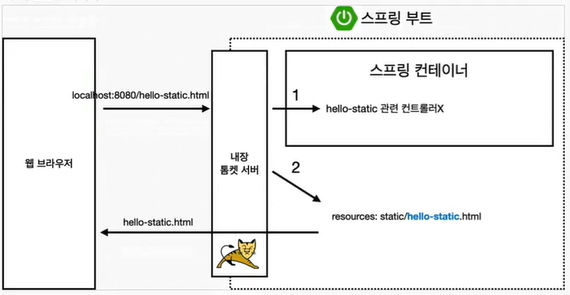
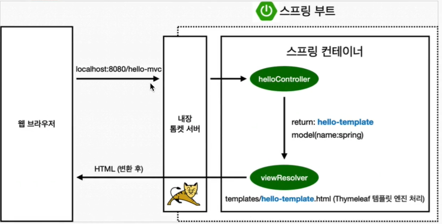
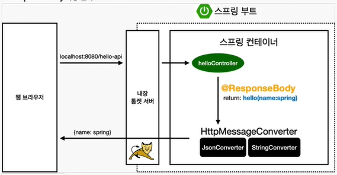
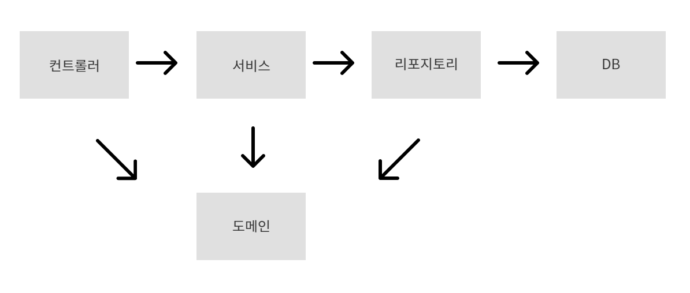
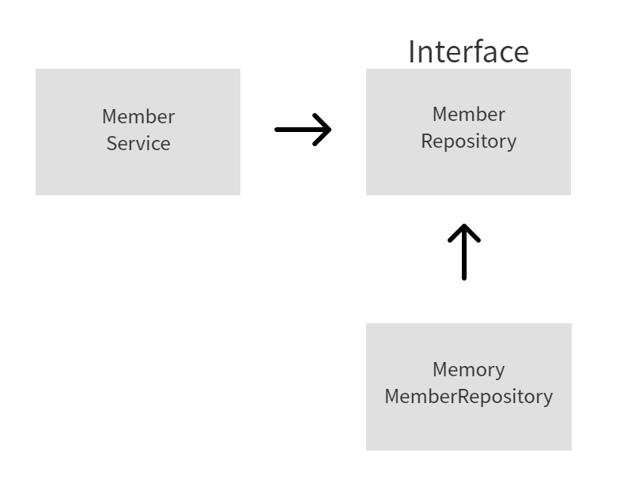
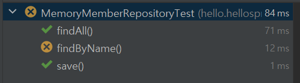
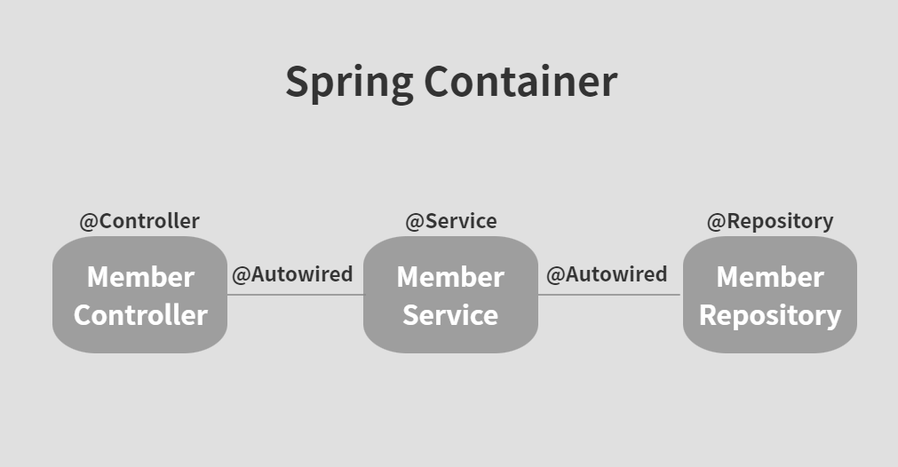
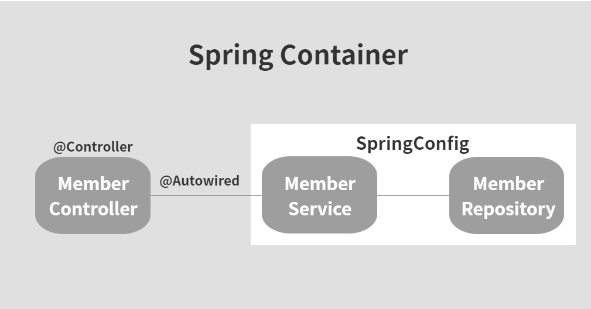
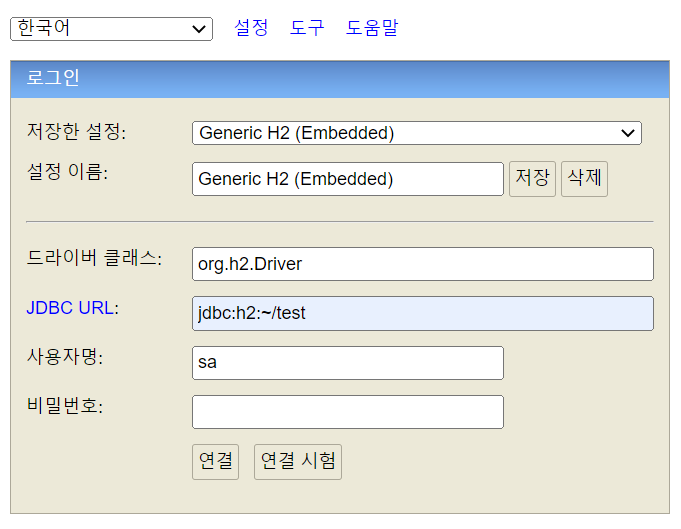
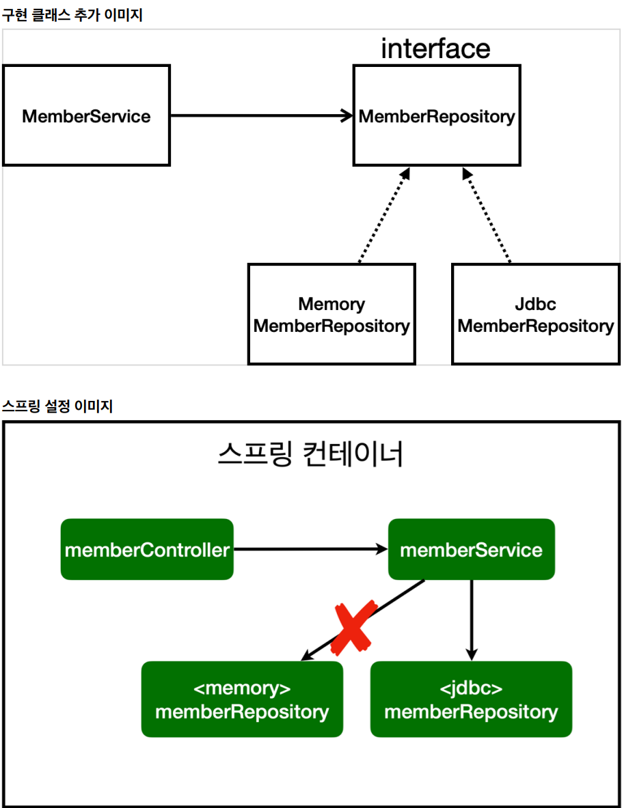

<details>
<summary>Section 01 : 프로젝트 환경설정</summary>

# 1-1. spring initializr

1. Gradle-Groovy
2. Spring Boot 2.7.11
3. Dependencies : Spring Web, Thymeleaf

# 1-2. spring boot library
1. spring-boot-starter-web
	spring-boot-starter-tomcat : 톰캣(웹서버)
	spring-webmvc: 스프링 웹 MVC
2. spring-boot-starter-thymeleaf : 타임리프 템플릿 엔진(view)
3. spring-boot-starter(공통) : 스프링부트 + 스프링코어 + 로깅
	spring-boot
		spring-core
	spring-boot-starter-logging
		logback(구현체), slf4j(인터페이스)

# 1-3. test library
1. spring-boot-starter-test
	junit : 테스트 프레임워크
	mockito : 목 라이브러리
	assertj : 테스트 코드를 좀더 편하게 작성하게끔 도와주는 라이브러리
	spring-test : 스프링 통합 테스트 지원

# 1-4. Doc 활용
1. spring.io 검색해서 project > springboot > learn 탭선택 > 사용하는버전의 reference doc선택
2. 프로젝트 개발시 도큐먼트 내용 검색할 수 있어야 함 !

# 1-5. window cmd창에서 프로젝트 빌드하고 실행하기
1. 우선 개발툴에서 실행중인 프로그램 모두 중지시키기
2. cmd창 켜서 프로젝트경로로 이동
3. gradlew.bat 입력
4. gradlew build 입력
5. 프로젝트 build폴더 내에 libs 내 빌드된 jar파일 존재확인
6. 해당 위치에서 java -jar 프로젝트명-SNAPSHOT.jar 입력

</details>


<details>
<summary>Section 02 : 스프링 웹 개발 기초</summary>

# 2-1. 정적컨텐츠



```
// Controller
@GetMapping("hello")
public String hello(Model model){
	model.addAttribute("data", "hello!!!");
	return "hello";
}

// View
<!DOCTYPE html>
<html>
	<body>
		정적 컨텐츠 입니다.
	</body>
</html>
```

# 2-2. MVC와 템플릿 엔진 : Thymeleaf



```
// Controller
@GetMapping("hello-mvc")
public String helloMvc(@RequestParam("name") String name, Model model){
	model.addAttribute("name", name);
	return "hello-template";
}

// View
<html xmlns:th="http://www.thymeleaf.org">
	<body>
		<p th:text="'hello ' + ${name}">hello! empty</p>
	</body>
</html>
```

# 2-3. API



```
// Controller
@GetMapping("hello-string")
@ResponseBody // http프로토콜 body부에 해당 데이터를 직접 입력해주겠다.
public String helloString(@RequestParam("name") String name){
	return "hello " + name;
}

@GetMapping("hello-api")
@ResponseBody
public Hello helloApi(@RequestParam("name") String name) {
	Hello hello = new Hello();
	hello.setName(name);
	return hello;
}

static class Hello {
	private String name;

	public String getName() {
		return name;
	}

	public void setName(String name) {
		this.name = name;
	}
}
```
</details>


<details>
<summary>Section 03 : 회원관리예제 - 백엔드 개발</summary>

# 3-1. [Step1]비즈니스 요구사항 정리   
-	데이터 : 회원ID, 이름
-	기능 : 회원 등록, 조회
-	아직 데이터 저장소가 선정되지 않음(가상의 시나리오)
-	동일한 이름의 회원은 등록할 수 없다.

**일반적인 웹 애플리케이션 계층 구조**



- 컨트롤러 : 웹 MVC의 컨트롤러 역할
- 서비스 : 핵심 비즈니스 로직 구현 (예)회원은 중복가입이 안된다.
- 리포지토리 : 데이터베이스에 접근, 도메인 객체를 DB에 저장하고 관리
- 도메인 : 비즈니스 도메인 객체 (예)회원, 주문, 쿠폰 등등 주로 DB에 저장하고 관리됨

**클래스 의존관계**



- 회원 비즈니스 로직에는 회원서비스(memberservice)가 있고, 회원저장소는 interface로 설계한다. 그 이유는 아직 데이터저장소가 선정되지 않았다는 사전조건 때문. 인터페이스로 설계하여 메모리에 저장하는 구현체로 개발을 진행하다가, 구체적인 기술이 선정되고 나면 쉽게 변경가능하도록 인터페이스로 설계
- 아직 데이터 저장소가 선정되지 않아서, 우선 인터페이스로 구현 클래스를 변경할 수 있도록 설계
- 데이터 저장소는 RDB, NoSQL 등등 다양한 저장소를 고민중인 상황으로 가짐
- 개발을 진행하기 위해서 초기 개발 단계에서는 구현체로 가벼운 메모리 기반의 데이터 저장소 사용


# 3-2. [Step2]회원 도메인과 리포지토리 만들기   
- Repository : 회원 도메인 객체를 저장하고 불러올 수 있는 저장소 객체

# 3-3. [Step3]회원 리포지토리 테스트 케이스 작성

**테스트 케이스 작성이유**

- 개발한 기능을 실행해서 테스트 할때, 자바의 main메스드를 통해 실행하거나 웹 애플리케이션의 컨트롤러를 통해서 해당 기능을 실행한다. 이러한 방법은 준비하고 실행하는데 오래걸리고, 반복 실행하기 어려우며, 여러 테스트를 한번에 실행하기 어렵다는 단점이 있다.
- 자바는 JUnit이라는 프레임워크로 테스트를 실행해서 이러한 문제를 해결한다.

**테스트 케이스 작성시 주의사항**



- 동일한 테스트클래스 내에 작성된 테스트메소드들은, 테스트클래스 전체를 실행할때 각 메소드가 작성된 순서대로 테스트되는 것이 아니라 인텔리제이 자체적인 규칙에 의해 실행된다.
- 여기서 발생할 수 있는 문제는, 메서드가 작성된 순서대로 실행되지 않기때문에 이전에 남아있는 데이터로 인해 테스트가 실패할 수도 있다는 것.
- 이를 방지하기 위해 테스트 케이스 작성시 꼭 해야할 과정이 있다.

```
// 테스트 대상 클래스 또는 인터페이스에 데이터가 저장되는 부분을 clear시켜주는 메소드를 하나 구현해둔다.
public void clearStore(){
	store.clear();
}

// 그런 후 테스트 클래스로 와서 
// 각 메소드가 실행되고 난 후 다음, 메소드가 실행되기 전에 이 메소드를 무조건 수행한다는 의미의 AfterEach 어노테이션을 붙여주고
// 메모리에 저장된 데이터를 제거하는 코드를 작성해준다.
@AfterEach
public void afterEach(){
	repository.clearStore();
}
```

- 위와 같은 과정을 거치면 테스트 순서에 상관없이 모든 메서드를 테스트할 수 있다.


- 테스트는 서로 의존관계 없이 (순서에 상관없이) 설계되어야 한다.
- 그러기위해선 하나의 테스트가 끝날때마다 공용저장소, 공용데이터들을 깔끔히 제거해줘야 한다.

**TDD, 테스트 주도 개발**
- 테스트 클래스를 먼저 작성한 다음 MemberRepository 등을 작성할 수도 있다.
- 무엇을 구현하기 전 틀을 먼저 만들어두고(테스트 케이스), 해당 틀을 기반으로 개발하는 방법
- 테스트를 먼저 만들고 구현 클래스를 만들어서 검증

# 3-4. [Step4]회원 서비스 개발(실제 비즈니스 로직에 있는 회원 서비스)

**네이밍 규칙**

- Repository는 save, findById, findByName, findAll 등 단순히 저장소에 데이터를 넣었다 뺐다 하는 듯한 느낌이 듦
- Service는 join, findMembers 등 조금 더 비즈니스에 가까운 느낌. 실제로 비즈니스 로직을 service에 작성하기도 하고.
- 결론은, 해당 클래스(또는 인터페이스)의 Role에 따라 네이밍을 신중하게 정해줘야할 필요성 있음.
- 서비스는 비즈니스에 의존적으로 설계를 하고, repository같은 경우는 기계적인, 단순한 데이터 입출력의 느낌으로 네이밍.

# 3-5. [Step5]회원 서비스 테스트(jUnit)

**테스트케이스 작성**

- 테스트클래스 자동생성 단축키 : 테스트 하고싶은 클래스명/인터페이스명에 커서를 두고 ctrl + shift + t(windows)
- 테스트는 한글로 작성해도 괜찮음. 어차피 빌드될때 테스트케이스 코드는 포함되지 않기때문에, 테스트시 직관성을 위해서 한글로 작성해도 OK

```
@Test
void join() { 

}

@Test
void 회원가입() { 

}

// 둘 다 가능
```

**테스트케이스 작성시, given - when - then 문법사용 권장**

- given : 무엇인가 주어졌을때
- when : 이것을 실행했을때
- then : 결과는 이렇게 나와야해

**실제코드에서 쓰이는 객체와, 테스트시 사용하는 객체는 동일한 걸로 맞춰주기 : DI**

```
// 기존코드
//	MemberService와 MemberServiceTest에서 사용되는 Repository는 서로 다른 객체.
public class MemberService {
	private final MemberRepository memberRepository = new MemoryMemberRepository();
}

class MemberServiceTest{
	MemoryMemberRepository memberRepository = new MemoryMemberRepository();
}


// 수정된 코드
//	MemberService에서 사용되는 Repository객체는 생성자를 만들어서 외부에서 전달하는 값으로 초기화시키기

public class MemberService {
	private final MemberRepository memberRepository;

    public MemberService(MemberRepository memberRepository) {
        this.memberRepository = memberRepository;
    }
}

//	MemberServiceTest에서는 개별테스트를 실행하기 전에 beforeEach메서드를 실행할 수 있게 @BeforeEach어노테이션을 이용하고, 메서드에서는 repository객체를 생성하여 이것을 MemberService생성자로 전달.
class MemberServiceTest{
	MemoryMemberRepository memberRepository;

    @BeforeEach
    public void beforeEach(){
        memberRepository = new MemoryMemberRepository();
        memberService = new MemberService(memberRepository);
    }
}

// 이렇게하면 실제코드에서 사용하는 Repository와 테스트에서 사용하는 Repository가 동일함.(메모리가 동일)
// 직접 new하는게 아니라 외부에서 주입해주는 것 = DI(의존성주입)
```
</details>


<details>
<summary>Section 04 : 스프링 빈과 의존관계</summary>

# 4-1. 컴포넌트 스캔과 자동 의존관계 설정

**스프링 빈을 등록하고 의존관계 설정하기**
: 회원컨트롤러에 의존관계 추가

- Service, Repository를 만들었으니 이제 화면을 구현할 차례.
- 그러기 위해선 Controller와 View Template가 필요.
- 우선, Controller생성.

```
// MemberController
// MemberService를 이용하여 비즈니스 로직을 처리해야하므로,
// new 키워드를 이용하여 service객체를 생성

@Controller
public class MemberController {
	private final MemberService memberService = new MemberService();
}

---

// 그런데 이러한 방식은 스프링스럽지 못함!
// 아래와 같이 memberService를 상수로 선언해주고
// MemberController 생성자를 만들어서 @Autowired을 걸어두면
// 스프링 어플리케이션이 실행될때 @Controller 어노테이션을 보고 스프링 컨테이너가 MemberController를 컨테이너에 저장하면서 MemberController생성자를 호출한다.
// 생성자를 호출하면서 memberService가 필요한 것을 보고 컨테이너에 있는 MemberRepository객체를 주입시킨다.

@Controller
public class MemberController {
    private final MemberService memberService;

    @Autowired
    public MemberController(MemberService memberService){
        this.memberService = memberService;
    }
}
```

- 생성자에 @Autowired 가 있으면 스프링이 연관된 객체를 **스프링 컨테이너**에서 찾아서 넣어준다. 이렇게 객체 의존 관계를 외부에서 넣어주는 것을 DI(Dependency Injection), 의존성 주입이라 한다.
- 이전 테스트에서는 개발자가 직접 주입했고, 여기서는 @Autowired에 의해 스프링이 주입해준다. 

```
// Service클래스에 가서도 동일하게 진행해주기
@Service
public class MemberService {
    private final MemberRepository memberRepository;

    @Autowired
    public MemberService(MemberRepository memberRepository) {
        this.memberRepository = memberRepository;
    }
}
```
- Controller, Service, Repository를 모두 @Controllrer, @Service, @Repository 어노테이션을 붙여서 SpringContainer에 등록해주고,
- 그 사이를 @Autowired를 통해 이어주면 아래와 같은 관계가 완성된다.

 

**컴포넌트 스캔**
- @Controller, @Service, @Repository 모두 @Componant어노테이션에 속함!
- 스프링이 실행될때, Component객체는 전부 SpringContainer에 등록됨.
- 그리고 @Autowired는 연관관계, SpringContainer에 등록된 객체끼리의 연관관계를 설정해줌.

- 정리하자면,
- @Component 어노테이션이 있으면 Spring Bean으로 자동등록된다. = Component Scan
- @Controller 컨트롤러가 스프링 빈으로 자동등록된 이유도 Component Scan 때문이다.
- @Component를 포함하는 다음 어노테이션도 Spring Bean으로 자동 등록된다.

> : @Controller, @Service, @Repository

**참고**
- main 클래스가 속해있는 패키지의 하위에서만 자동 컴포넌트스캔이 이뤄지며, main클래스와 동일한 위치거나 그 외의 위치는 별도의 설정을 통해 컴포넌트스캔을 실행할 수 있다.
- 스프링은 스프링 컨테이너에 스프링 빈을 등록할때, 기본으로 싱글톤으로 등록한다.(유일하게 하나만 등록해서 공유한다.) 따라서 같은 스프링빈이면 모두 같은 인스턴스이다. 설정으로 싱글톤이 아니게 설정할 수 있지만, 특별한 경우를 제외하면 대부분 싱글톤을 사용한다. → 메모리 절약 가능

# 4-2. 자바 코드로 직접 스프링 빈 등록하기

- 회원 서비스와 회원 리포지토리의 @Service, @Repository, @Autowired 어노테이션을 제거하고 진행
- main클래스가 있는 위치에 SpringConfig 클래스를 생성
- SpringConfig 클래스에다 memberService와 memberRepository를 아래와같이 @Bean어노테이션을 이용하여 스프링 컨테이너에 등록해줌.

```
package hello.hellospring;

import hello.hellospring.repository.MemberRepository;
import hello.hellospring.repository.MemoryMemberRepository;
import hello.hellospring.service.MemberService;
import org.springframework.context.annotation.Bean;
import org.springframework.context.annotation.Configuration;

@Configuration
public class SpringConfig {

    @Bean
    public MemberService memberService(){
        return new MemberService(memberRepository());
    }

    @Bean
    public MemberRepository memberRepository(){
        return new MemoryMemberRepository();
    }
}
```

- 이렇게 설정해주면 아래와 같은 관계가 만들어진다.



- 컴포넌트 스캔을 이용한 자동의존관계 설정시에는 @Controller, @Service, @Repository 어노테이션으로 컴포넌트들을 SpringBean으로 등록하고, @Autowired를 통해 의존관계를 자동으로 설정해주었다면,
- 이 방식은 Service와 Repository를 SpringConfig라는 @Configuration 클래스에 @Bean을 이용해 직접 SpringContainer에다 등록하고, new MemberService(memberRepository()) 처럼 직접 의존관계를 설정해준다.

**컴포넌트스캔과 자동의존관계 vs 자바코드로 직접**
- 실무에서는 주로 정형화된 컨트롤러, 서비스, 리포지토리 같은 코드는 컴포넌트 스캔을 이용한다.
- <U>정형화되지 않거나, 상황에 따라 구현 클래스를 변경해야 하면</U> 자바 코드로 직접 설정을 통해 스프링 빈으로 등록한다.    
	→ (ex)만약 인터페이스 구현체를 변경해야한다면, 컴포넌트스캔시 해당 클래스들을 방문하여 관련 어노테이션을 다 삭제해줘야하는 반면, config파일로 관리할때에는 config파일 하나면 수정하면 되므로, 수정이 훨씬 용이함.

> 우리는 향후 메모리 리포지토리를 다른 리포지토리로 변경할 예정이므로, 컴포넌트 스캔 방식 대신에 자바 코드로 스프링 빈을 설정하겠다.

**참고**
- DI에는 필드주입, setter주입, 생성자 주입 이렇게 3가지 방법이 있다. 객체간 의존관계는 런타임시에 동적으로 변하는 경우가 없으므로 생성자 주입을 권장한다.

	```
	1. 생성자주입
	@Controller
	public class MemberController{
		
		private final MemberService memberService;

		@Autowired
		public MemberController(MemberService memberService){
			this.memberService = memberService;
		}

	}
	: SpringContainer에서 주입시켜준 memberService를 final 상수에다 저장하고 해당 컨트롤러 클래스 내에서 사용하기때문에 값이 중간에 변경될 위험이 적고 안전하게 사용가능


	2. 필드주입
	@Controller
	public class MemberController{

		@Autowired
		private MemberService memberService;
	} 
	: 필드주입은 프로젝트가 실행되는 그 시점에만 memberService를 주입해주고, 그 뒤로 해당 값을 변경해줄 수 있는 방법이 없음. 중간에 값을 변경해줘야할 경우가 있다고 가정했을때 필드주입은 그에 대한 방법이 없으므로 비추천!


	3. setter주입
	@Controller
	public class MemberController{

		private MemberService memberService;

		@Autowired
		public void setMemberService(MemberService memberService){
			this.memberService = memberService;
		}
	}
	: setter주입은 어느 코드에서건 memberService.setMemberService() 와 같이 memberService 값을 설정해줄 수 있는 set메소드 호출이 가능하므로, 중간에 값이 바뀔 위험이 큼. 호출하지 않아도 되는 메서드는 호출 되지않는게 가장 좋음.

	4. 결론
	: 따라서 DI방식 중에선 생성자주입방식이 가장 좋다 !
	```
- [주의] @Autowired를 통한 DI는 스프링이 관리하는 객체(SpringContainer에 등록된)에서만 동작한다. 스프링 빈으로 등록하지 않고 내가 직접 생성한 객체에서는 동작하지 않는다.


</details>


<details>
<summary>Section 05 : 회원관리예제-웹MVC개발</summary>

# 5-1. 회원 웹 기능 - 홈 화면 추가

**웹페이지 조회순서**


- localhost:8080 를 주소창에 입력했을때, 내장톰캣서버는 가장 먼저 SpringContainer에 저장되어 있는 컨트롤러 중 해당 자원과 관련된 컨트롤러를 찾아본다.(매핑주소가 "/"인 컨트롤러)
- 해당 컨트롤러가 존재하지 않으면 static파일 하위에 요청하는 자원과 동일한 이름의 html파일을 웹 브라우저로 전송하여 응답한다.

</details>


<details>
<summary>Section 06 : 스프링 DB 접근 기술</summary>

# 6-1. H2 데이터베이스 설치

1. /h2/bin/h2.bat 실행
2. 실행



3. JDBC URL에 jdbc:h2:~/test 확인 → 연결
4. 홈디렉토리에 test.mv.db 있는지 확인
5. 이후 접속할때는 JDBC URL에 jdbc:h2:tcp://localhost/~/test 입력하여 연결하기 → 파일위치로 데이터 접속시 이래저래 꼬일 염려 있음
6. 추후 문제 생겼을때, 홈디렉토리에 있는 test.mv.db 파일 삭제    
→ h2 db 서버 완전히 내려서 끈 후 → 다시 h2.bat 실행 → 3번부터 차례대로 다시 실행

# 6-2. 순수 JDBC

**환경설정**
- build.gradle 파일에 jdbc, h2 데이터베이스 관련 라이브러리 추가
> implementation 'org.springframework.boot:spring-boot-starter-jdbc'   
runtimeOnly 'com.h2database:h2'

- 스프링부트 데이터베이스 연결설정 추가 : resources/application.properties
> spring.datasource.url=jdbc:h2:tcp://localhost/~/test   
spring.datasource.driver-class-name=org.h2.Driver   
spring.datasource.username=sa

**코드작성**

<details>
<summary>ㅤ[JdbcMemberRepository 코드]</summary>

```
public class JdbcMemberRepository implements MemberRepository {

    private final DataSource dataSource;

    public JdbcMemberRepository(DataSource dataSource){
        this.dataSource = dataSource;
    }

    @Override
    public Member save(Member member) {
        String sql = "insert into member(name) values(?)";
			Connection conn = null;
			PreparedStatement pstmt = null;
			ResultSet rs = null;
			try {
				conn = getConnection();
				pstmt = conn.prepareStatement(sql,
						Statement.RETURN_GENERATED_KEYS);
				pstmt.setString(1, member.getName());
				pstmt.executeUpdate();
				rs = pstmt.getGeneratedKeys();
				if (rs.next()) {
					member.setId(rs.getLong(1));
				} else {
					throw new SQLException("id 조회 실패");
				}
				return member;
			} catch (Exception e) {
				throw new IllegalStateException(e);
			} finally {
				close(conn, pstmt, rs);
			}
		}
		@Override
		public Optional<Member> findById(Long id) {
			String sql = "select * from member where id = ?";
			Connection conn = null;
			PreparedStatement pstmt = null;
			ResultSet rs = null;
			try {
				conn = getConnection();
				pstmt = conn.prepareStatement(sql);
				pstmt.setLong(1, id);
				rs = pstmt.executeQuery();
				if(rs.next()) {
					Member member = new Member();
					member.setId(rs.getLong("id"));
					member.setName(rs.getString("name"));
					return Optional.of(member);
				} else {
					return Optional.empty();
				}
			} catch (Exception e) {
				throw new IllegalStateException(e);
			} finally {
				close(conn, pstmt, rs);
			}
		}
		@Override
		public List<Member> findAll() {
			String sql = "select * from member";
			Connection conn = null;
			PreparedStatement pstmt = null;
			ResultSet rs = null;
			try {
				conn = getConnection();
				pstmt = conn.prepareStatement(sql);
				rs = pstmt.executeQuery();
				List<Member> members = new ArrayList<>();
				while(rs.next()) {
					Member member = new Member();
					member.setId(rs.getLong("id"));
					member.setName(rs.getString("name"));
					members.add(member);
				}
				return members;
			} catch (Exception e) {
				throw new IllegalStateException(e);
			} finally {
				close(conn, pstmt, rs);
			}
		}
		@Override
		public Optional<Member> findByName(String name) {
			String sql = "select * from member where name = ?";
			Connection conn = null;
			PreparedStatement pstmt = null;
			ResultSet rs = null;
			try {
				conn = getConnection();
				pstmt = conn.prepareStatement(sql);
				pstmt.setString(1, name);
				rs = pstmt.executeQuery();
				if(rs.next()) {
					Member member = new Member();
					member.setId(rs.getLong("id"));
					member.setName(rs.getString("name"));
					return Optional.of(member);
				}
				return Optional.empty();
			} catch (Exception e) {
				throw new IllegalStateException(e);
			} finally {
				close(conn, pstmt, rs);
			}
		}
		private Connection getConnection() {
			return DataSourceUtils.getConnection(dataSource);
		}
		private void close(Connection conn, PreparedStatement pstmt, ResultSet rs)
		{
			try {
				if (rs != null) {
					rs.close();
				}
			} catch (SQLException e) {
				e.printStackTrace();
			}
			try {
				if (pstmt != null) {
					pstmt.close();
				}
			} catch (SQLException e) {
				e.printStackTrace();
			}
			try {
				if (conn != null) {
					close(conn);
				}
			} catch (SQLException e) {
				e.printStackTrace();
			}
		}
		private void close(Connection conn) throws SQLException {
			DataSourceUtils.releaseConnection(conn, dataSource);
		}
	}

```

**참고**

1. Connection맺었으면 꼭 릴리즈해서 자원을 반환해줘야 함. → close()메소드
2. 상수로 connection을 설정하지 말고 DataSourceUtils.getConnection()을 통해 커넥션을 받아오는게 더 좋음. 이렇게해야 트랜잭션 여러개 실행시 데이터베이스 커넥션을 동일하게 유지할 수 있음. → getConnection()메소드

</details>

**Repository 구현체 변경**
- 이제 기존에 메모리 저장방식에서 h2데이터베이스 저장방식으로 Repository구현체를 변경해주어야 한다. (MemoryMemberRepository → JdbcMemberRepository 변경)
- 이렇게 구현체를 변경하기 위해 의존관계를 SpringConfig파일에서 자바코드로 직접 구현해둔 상태!
- 그렇다는건 결국 SpringConfig파일만 수정하면 됨

```
@Configuration
public class SpringConfig {

    private DataSource dataSource;

    @Autowired
    public SpringConfig(DataSource dataSource){
        this.dataSource = dataSource;
    }

    @Bean
    public MemberService memberService(){
        return new MemberService(memberRepository());
    }

    @Bean
    public MemberRepository memberRepository(){
        return new JdbcMemberRepository(dataSource);
    }
}
```
- DataSource를 Springconfig생성자를 통해 DI받아서 선언해주고, memberRepository()메소드에서 return값을 dataSource를 매개값으로 받는 JdbcMemberRepository로 변경해주면 설정이 완료된다.



- 개방-폐쇄 원칙(OCP, Open-Closed Principle) : 확장에는 열려있고, 수정 및 변경에는 닫혀있다.
- 스프링의 DI(Dependencies Injection)을 사용하면 기존 코드를 전혀 손대지 않고, 설정만으로 구현클래스를 변경할 수 있다.
- 이제 데이터를 DB에 저장하므로 스프링 서버를 껐다가 다시 실행해도 데이터가 안전하게 저장된다.

# 6-3. 스프링 통합 테스트

**통합 테스트코드 작성**
- 이전 테스트코드는 스프링과 전혀 관계없는 순수한 자바 코드를 테스트한 것. 그게 가능했던 이유는 데이터를 메모리에 저장하기때문에 Connection객체를 만들필요가 없었기 때문.
- 하지만 지금은 상황이 다름. 실제 DB에 연결하여 데이터를 정상적으로 주고받는지를 테스트해야하므로, 스프링 자체를 껐다 켰다 하면서 테스트할 수 밖에 없음.
- 테스트 코드는 기존 MemberServiceTest클래스를 복붙해서 몇가지만 수정하여 작성.

	```
	@SpringBootTest
	@Transactional
	class MemberServiceIntegrationTest {
	// 이전에는 Service, Repository객체를 직접 생성해서 넣었으니 해당 메소드가 필요했는데,
	// 이제는 스프링 컨테이너한테 service, repository 내놔! 하면 되니까 없애기.
	//    MemberService memberService;
	//    MemoryMemberRepository memberRepository;
	//
	//    @BeforeEach
	//    public void beforeEach(){
	//        memberRepository = new MemoryMemberRepository();
	//        memberService = new MemberService(memberRepository);
	//    }

		// 위의 코드를 이렇게 변경.
		// 의존성 주입방법 중 생성자방식을 가장 권유하지만,
		// 이건 테스트코드이므로 필드주입방식이든 뭐든 편한대로 쓰면 됨
		@Autowired MemberService memberService;
		@Autowired MemberRepository memberRepository;

	// 이것도 @Transactional 어노테이션 덕분에 필요없어짐
	//    @AfterEach
	//    public void afterEach(){
	//        memberRepository.clearStore();
	//    }

		@Test
		void join() {
			//given
			Member member = new Member();
			member.setName("spring");

			//when
			Long saveId = memberService.join(member);

			//then
			Member findMember = memberService.findOne(saveId).get();
			assertThat(member.getName()).isEqualTo(findMember.getName());
		}

		@Test
		public void 중복_회원_예외(){
			//given
			Member member1 = new Member();
			member1.setName("spring");

			Member member2 = new Member();
			member2.setName("spring");

			//when
			memberService.join(member1);
			//      member2를 넣으면 IllegalState예외가 터져야한다.
			//      예외가 터지면 테스트가 성공이라고 출력됨
			IllegalStateException e = assertThrows(IllegalStateException.class, () -> memberService.join(member1));
			assertThat(e.getMessage()).isEqualTo("이미 존재하는 회원입니다.");

			/*
			try{
				// 예외가 발생해야함
				memberService.join(member2);
				fail();
			}catch(IllegalStateException e){
				assertThat(e.getMessage()) .isEqualTo("이미 존재하는 회원입니다.");
			}
			*/

			//then
		}
	}
	```

- @SpringBootTest : 스프링 프로젝트를 실행해서 테스트를 진행해야하므로, 해당 어노테이션 필수! 스프링 컨테이너와 테스트를 함께 실행한다.
- @Transactional 
: 테스트 케이스에 해당 어노테이션이 있으면 테스트 시작 전에 트랜잭션을 시작하고, 테스트 완료 후에 항상 롤백한다. 이렇게 하면 DB에 데이터가 남지 않으므로 다음 테스트에 영향을 주지 않는다. → 즉, 다음 테스트를 반복적으로 실행할 수 있음.
: 해당 어노테이션이 Service 등에 붙으면 rollback하지 않고 정상적으로 실행되고, 테스트케이스에 붙었을때만 rollback을 통해 DB에 데이터를 남기지 않음

> [참고] 현업에선 보통 테스트 전용 DB를 따로 구축함

**<U>단위테스트</U> vs 통합테스트**
- 순수하게 자바코드로 최소한의 기능을 테스트해보는 것을 단위테스트, 스프링을 실행하고 DB까지 연결해서 서비스 전체를 통합적으로 테스트해보는 것을 통합테스트라고 한다.
- 단위테스트를 잘하는 것이 더 중요. 스프링 컨테이너없이 개별 단위들을 테스트할 수 있는 코드를 짜는 것이 중요하다. 물론 통합테스트가 필요한 경우도 있지만, 되도록 스프링 컨테이너를 동원한 테스트코드 작성은 지양하는 것이 좋음. 
# 6-4. 스프링 JdbcTemplate

**JdbcTemplate**
- 개발자가 JDBC기술을 쉽게 사용할 수 있도록 도와주는 서비스
- Spring DB접근기술 변화 : 순수JDBC → JdbcTemplate or MyBatis → JPA
- 사용법   
: Jdbc는 아래와 같은 DI가 불가능하며, DataSource가 필요하다.
	```
	public class JdbcTemplateMemberRepository implements MemberRepository{
		private final JdbcTemplate jdbcTemplate;

		@Autowired
		public JdbcTemplateMemberRepository(JdbcTemplate jdbcTemplate){
			this.jdbcTemplate = jdbcTemplate;
		}	
	}
	```
	: 그러므로 생성자를 통해 DataSource가 Injection받아서 상수로 선언한 jdbcTemplate에 넣어 사용하는 것을 권장
	```
	public class JdbcTemplateMemberRepository implements MemberRepository{
		private final JdbcTemplate jdbcTemplate;

		@Autowired
		public JdbcTemplateMemberRepository(DataSource dataSource){
			jdbcTemplate = new JdbcTemplate(dataSource);
		}
	}
	```
<details>
<summary>ㅤ[JdbcTemplateMemberRepository 코드]</summary>

```
public class JdbcTemplateMemberRepository implements MemberRepository{

    private final JdbcTemplate jdbcTemplate;

    @Autowired
    public JdbcTemplateMemberRepository(DataSource dataSource){
        jdbcTemplate = new JdbcTemplate(dataSource);
    }


    @Override
    public Member save(Member member) {
        SimpleJdbcInsert jdbcInsert = new SimpleJdbcInsert(jdbcTemplate); // jdbcTemplate을 넣어서 insert객체를 만듦
        jdbcInsert.withTableName("member").usingGeneratedKeyColumns("id"); // insert객체 설정. 테이블이름 member, pk컬럼은 id

        Map<String, Object> parameters = new HashMap<>(); // values로 입력할 값을 담을 map타입 변수 parameters
        parameters.put("name", member.getName()); // parameters에 메소드 매개값으로 받은 member의 name을 넘겨줌. (컬럼명, 값)

        Number key = jdbcInsert.executeAndReturnKey(new MapSqlParameterSource(parameters)); // insert문 실행 및 해당 row의 pk값 반환
        member.setId(key.longValue()); // save메소드의 매개값으로 받은 member에 id를 전달받은 pk값으로 넣어줌

        return member; // member 객체를 반환 Member{id:pk값, name:전달받은이름};
    }


    @Override
    public Optional<Member> findById(Long id) {
        // jdbcTemplate.query()를 통해 입력한 쿼리문을 실행해서 결과를 가져온 후,
        // 이것을 memberRowMapper()메소드를 호출해서 RowMapper객체를 이용해 Member객체로 변환시켜서 Optional로 return
        List<Member> result = jdbcTemplate.query("select * from member where id = ?", memberRowMapper(), id);
        return result.stream().findAny();
    }


    @Override
    public Optional<Member> findByName(String name) {
        List<Member> result = jdbcTemplate.query("select * from member where name = ?", memberRowMapper(), name);
        return result.stream().findAny();
    }


    @Override
    public List<Member> findAll() {
        return jdbcTemplate.query("select * from member", memberRowMapper());
    }


    private RowMapper<Member> memberRowMapper(){
        return new RowMapper<Member>(){ // 익명클래스(내부클래스의 일종), return값은 RowMapper<Member>이다.
            // new 인터페이스명() <- 이것만 보면 RowMapper 인터페이스를 클래스 생성자처럼 초기화해서 인스턴스화 한 것 같지만,
            // 인터페이스는 객체를 만들 수 없으므로 이건 자식 클래스를 생성해서 implements하고 클래스를 초기화한 것과 동일.
            // 익명클래스를 작성함과 동시에 객체를 생성하도록 하는 Java의 문법으로 보면 됨.
            @Override // RowMapper클래스에 있는 mapRow를 재정의
            public Member mapRow(ResultSet rs, int rowNum) throws SQLException{
                Member member = new Member();
                member.setId(rs.getLong("id"));
                member.setName(rs.getString("name"));

                return member;
            }
        };
    }


    // 위 memberRepository() 메소드를 람다로 바꾸면 아래와 같다.
    private RowMapper<Member> lambda_memberRowMapper(){
        return (rs, rowNum) -> {
            Member member = new Member();
            member.setId(rs.getLong("id"));
            member.setName(rs.getString("name"));
            return member;
        };
    }
}

```
</details>

**정리**
> (1) jdbcTemplate.query( [1] , [2] , [3])
- [1] : 실행할 쿼리문
- [2] : RowMapper()
- [3] : 쿼리문에 ?로 처리된 파라미터
> (2) RowMapper()
- jdbcTemplate이 받아온 쿼리결과를 사용자가 원하는 형태로 변환할 수 있다.
- 순수 JDBC를 사용할때는 결과값을 ResultSet으로 반환받아서 이것을 while문을 돌며 객체에 직접 담아 사용했다.
	```
	// 쿼리날리고 결과 받아오기
	rs = pstmt.executeQuery();

	// 받아온 결과를 while문 돌면서 Member객체에 satter로 일일이 다 넣어주기
	List<Member> members = new ArrayList<>();
	while(rs.next()) {
		Member member = new Member();
		member.setId(rs.getLong("id"));
		member.setName(rs.getString("name"));
		members.add(member);
	}
	return members;
	```
- RowMapper의 mapRow메소드는 이러한 ResultSet을 이용하여 사용자가 원하는 형태로 쿼리결과를 변환한다. 
- 사용법은 **mapRow(ResultSet rs, int rowNum);** 으로, ResultSet에 값을 담아와서 rowNum만큼 반복하며 Member객체에 저장한다.
	```
	private RowMapper<Member> memberRowMapper(){
			return new RowMapper<Member>(){ 
				@Override 
				public Member mapRow(ResultSet rs, int rowNum) throws SQLException{
					Member member = new Member();
					member.setId(rs.getLong("id"));
					member.setName(rs.getString("name"));

					return member;
				}
			};
		}
	```
> (3) 익명클래스 : memberRowMapper()
- <U>[참고링크 : inpa.tistory.com](https://inpa.tistory.com/entry/JAVA-%E2%98%95-%EC%9D%B5%EB%AA%85-%ED%81%B4%EB%9E%98%EC%8A%A4Anonymous-Class-%EC%82%AC%EC%9A%A9%EB%B2%95-%EB%A7%88%EC%8A%A4%ED%84%B0%ED%95%98%EA%B8%B0)</U>
- 내가 이해한 내용
	```
	private RowMapper<Member> memberRowMapper(){
		return new RowMapper<Member>(){ // 익명클래스(내부클래스의 일종), return값은 RowMapper<Member>이다.
			// new 인터페이스명() <- 이것만 보면 RowMapper 인터페이스를 클래스 생성자처럼 초기화해서 인스턴스화 한 것 같지만,
			// 인터페이스는 객체를 만들 수 없으므로 이건 자식 클래스를 생성해서 implements하고 클래스를 초기화한 것과 동일.
			// 익명클래스를 작성함과 동시에 객체를 생성하도록 하는 Java의 문법으로 보면 됨.
			@Override // RowMapper클래스에 있는 mapRow를 재정의
			public Member mapRow(ResultSet rs, int rowNum) throws SQLException{
				Member member = new Member();
				member.setId(rs.getLong("id"));
				member.setName(rs.getString("name"));

				return member;
			}
		};
	}
	```
</details>