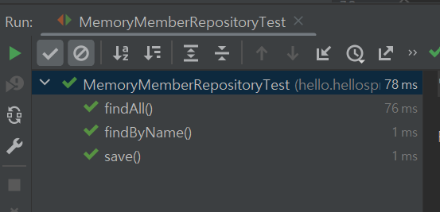

<details>
<summary>Section 01 : 프로젝트 환경설정</summary>

# spring initializr

1. Gradle-Groovy
2. Spring Boot 2.7.11
3. Dependencies : Spring Web, Thymeleaf

# spring boot library
1. spring-boot-starter-web
	spring-boot-starter-tomcat : 톰캣(웹서버)
	spring-webmvc: 스프링 웹 MVC
2. spring-boot-starter-thymeleaf : 타임리프 템플릿 엔진(view)
3. spring-boot-starter(공통) : 스프링부트 + 스프링코어 + 로깅
	spring-boot
		spring-core
	spring-boot-starter-logging
		logback(구현체), slf4j(인터페이스)

# test library
1. spring-boot-starter-test
	junit : 테스트 프레임워크
	mockito : 목 라이브러리
	assertj : 테스트 코드를 좀더 편하게 작성하게끔 도와주는 라이브러리
	spring-test : 스프링 통합 테스트 지원

# Doc 활용
1. spring.io 검색해서 project > springboot > learn 탭선택 > 사용하는버전의 reference doc선택
2. 프로젝트 개발시 도큐먼트 내용 검색할 수 있어야 함 !

# window cmd창에서 프로젝트 빌드하고 실행하기
1. 우선 개발툴에서 실행중인 프로그램 모두 중지시키기
2. cmd창 켜서 프로젝트경로로 이동
3. gradlew.bat 입력
4. gradlew build 입력
5. 프로젝트 build폴더 내에 libs 내 빌드된 jar파일 존재확인
6. 해당 위치에서 java -jar 프로젝트명-SNAPSHOT.jar 입력

</details>

<details>
<summary>Section 02 : 스프링 웹 개발 기초</summary>

# 정적컨텐츠


```
// Controller
@GetMapping("hello")
public String hello(Model model){
	model.addAttribute("data", "hello!!!");
	return "hello";
}

// View
<!DOCTYPE html>
<html>
	<body>
		정적 컨텐츠 입니다.
	</body>
</html>
```

# MVC와 템플릿 엔진 : Thymeleaf


```
// Controller
@GetMapping("hello-mvc")
public String helloMvc(@RequestParam("name") String name, Model model){
	model.addAttribute("name", name);
	return "hello-template";
}

// View
<html xmlns:th="http://www.thymeleaf.org">
	<body>
		<p th:text="'hello ' + ${name}">hello! empty</p>
	</body>
</html>
```

# API


```
// Controller
@GetMapping("hello-string")
@ResponseBody // http프로토콜 body부에 해당 데이터를 직접 입력해주겠다.
public String helloString(@RequestParam("name") String name){
	return "hello " + name;
}

@GetMapping("hello-api")
@ResponseBody
public Hello helloApi(@RequestParam("name") String name) {
	Hello hello = new Hello();
	hello.setName(name);
	return hello;
}

static class Hello {
	private String name;

	public String getName() {
		return name;
	}

	public void setName(String name) {
		this.name = name;
	}
}
```
</details>

<details>
<summary>Section 03 : 회원관리예제 - 백엔드 개발</summary>

# Step1. 비즈니스 요구사항 정리   
-	데이터 : 회원ID, 이름
-	기능 : 회원 등록, 조회
-	아직 데이터 저장소가 선정되지 않음(가상의 시나리오)
-	동일한 이름의 회원은 등록할 수 없다.

**일반적인 웹 애플리케이션 계층 구조**


- 컨트롤러 : 웹 MVC의 컨트롤러 역할
- 서비스 : 핵심 비즈니스 로직 구현 (예)회원은 중복가입이 안된다.
- 리포지토리 : 데이터베이스에 접근, 도메인 객체를 DB에 저장하고 관리
- 도메인 : 비즈니스 도메인 객체 (예)회원, 주문, 쿠폰 등등 주로 DB에 저장하고 관리됨

**클래스 의존관계**


- 회원 비즈니스 로직에는 회원서비스(memberservice)가 있고, 회원저장소는 interface로 설계한다. 그 이유는 아직 데이터저장소가 선정되지 않았다는 사전조건 때문. 인터페이스로 설계하여 메모리에 저장하는 구현체로 개발을 진행하다가, 구체적인 기술이 선정되고 나면 쉽게 변경가능하도록 인터페이스로 설계
- 아직 데이터 저장소가 선정되지 않아서, 우선 인터페이스로 구현 클래스를 변경할 수 있도록 설계
- 데이터 저장소는 RDB, NoSQL 등등 다양한 저장소를 고민중인 상황으로 가짐
- 개발을 진행하기 위해서 초기 개발 단계에서는 구현체로 가벼운 메모리 기반의 데이터 저장소 사용


# Step2. 회원 도메인과 리포지토리 만들기   
- Repository : 회원 도메인 객체를 저장하고 불러올 수 있는 저장소 객체

# Step3. 회원 리포지토리 테스트 케이스 작성

**테스트 케이스 작성이유**

- 개발한 기능을 실행해서 테스트 할때, 자바의 main메스드를 통해 실행하거나 웹 애플리케이션의 컨트롤러를 통해서 해당 기능을 실행한다. 이러한 방법은 준비하고 실행하는데 오래걸리고, 반복 실행하기 어려우며, 여러 테스트를 한번에 실행하기 어렵다는 단점이 있다.
- 자바는 JUnit이라는 프레임워크로 테스트를 실행해서 이러한 문제를 해결한다.

**테스트 케이스 작성시 주의사항**


- 동일한 테스트클래스 내에 작성된 테스트메소드들은, 테스트클래스 전체를 실행할때 각 메소드가 작성된 순서대로 테스트되는 것이 아니라 인텔리제이 자체적인 규칙에 의해 실행된다.
- 여기서 발생할 수 있는 문제는, 메서드가 작성된 순서대로 실행되지 않기때문에 이전에 남아있는 데이터로 인해 테스트가 실패할 수도 있다는 것.
- 이를 방지하기 위해 테스트 케이스 작성시 꼭 해야할 과정이 있다.

```
// 테스트 대상 클래스 또는 인터페이스에 데이터가 저장되는 부분을 clear시켜주는 메소드를 하나 구현해둔다.
public void clearStore(){
	store.clear();
}

// 그런 후 테스트 클래스로 와서 
// 각 메소드가 실행되고 난 후 다음, 메소드가 실행되기 전에 이 메소드를 무조건 수행한다는 의미의 AfterEach 어노테이션을 붙여주고
// 메모리에 저장된 데이터를 제거하는 코드를 작성해준다.
@AfterEach
public void afterEach(){
	repository.clearStore();
}
```

- 위와 같은 과정을 거치면 테스트 순서에 상관없이 모든 메서드를 테스트할 수 있다.



- 테스트는 서로 의존관계 없이 (순서에 상관없이) 설계되어야 한다.
- 그러기위해선 하나의 테스트가 끝날때마다 공용저장소, 공용데이터들을 깔끔히 제거해줘야 한다.

**TDD, 테스트 주도 개발**
- 테스트 클래스를 먼저 작성한 다음 MemberRepository 등을 작성할 수도 있다.
- 무엇을 구현하기 전 틀을 먼저 만들어두고(테스트 케이스), 해당 틀을 기반으로 개발하는 방법
- 테스트를 먼저 만들고 구현 클래스를 만들어서 검증

# Step4. 회원 서비스 개발(실제 비즈니스 로직에 있는 회원 서비스)

**네이밍 규칙**

- Repository는 save, findById, findByName, findAll 등 단순히 저장소에 데이터를 넣었다 뺐다 하는 듯한 느낌이 듦
- Service는 join, findMembers 등 조금 더 비즈니스에 가까운 느낌. 실제로 비즈니스 로직을 service에 작성하기도 하고.
- 결론은, 해당 클래스(또는 인터페이스)의 Role에 따라 네이밍을 신중하게 정해줘야할 필요성 있음.
- 서비스는 비즈니스에 의존적으로 설계를 하고, repository같은 경우는 기계적인, 단순한 데이터 입출력의 느낌으로 네이밍.

# Step5. 회원 서비스 테스트(jUnit)

**테스트케이스 작성**

- 테스트클래스 자동생성 단축키 : 테스트 하고싶은 클래스명/인터페이스명에 커서를 두고 ctrl + shift + t(windows)
- 테스트는 한글로 작성해도 괜찮음. 어차피 빌드될때 테스트케이스 코드는 포함되지 않기때문에, 테스트시 직관성을 위해서 한글로 작성해도 OK

```
@Test
void join() { 

}

@Test
void 회원가입() { 

}

// 둘 다 가능
```

**테스트케이스 작성시, given - when - then 문법사용 권장**

- given : 무엇인가 주어졌을때
- when : 이것을 실행했을때
- then : 결과는 이렇게 나와야해

**실제코드에서 쓰이는 객체와, 테스트시 사용하는 객체는 동일한 걸로 맞춰주기 : DI**

```
// 기존코드
//		MemberService와 MemberServiceTest에서 사용되는 Repository는 서로 다른 객체.
public class MemberService {
	private final MemberRepository memberRepository = new MemoryMemberRepository();
}

class MemberServiceTest{
	MemoryMemberRepository memberRepository = new MemoryMemberRepository();
}


// 수정된 코드
//		MemberService에서 사용되는 Repository객체는 생성자를 만들어서 외부에서 전달하는 값으로 초기화시키기

public class MemberService {
	private final MemberRepository memberRepository;

    public MemberService(MemberRepository memberRepository) {
        this.memberRepository = memberRepository;
    }
}

//		MemberServiceTest에서는 개별테스트를 실행하기 전에 beforeEach메서드를 실행할 수 있게 @BeforeEach어노테이션을 이용하고, 메서드에서는 repository객체를 생성하여 이것을 MemberService생성자로 전달.
class MemberServiceTest{
	MemoryMemberRepository memberRepository;

    @BeforeEach
    public void beforeEach(){
        memberRepository = new MemoryMemberRepository();
        memberService = new MemberService(memberRepository);
    }
}

// 이렇게하면 실제코드에서 사용하는 Repository와 테스트에서 사용하는 Repository가 동일함.(메모리가 동일)
// 직접 new하는게 아니라 외부에서 주입해주는 것 = DI(의존성주입)
```
</details>